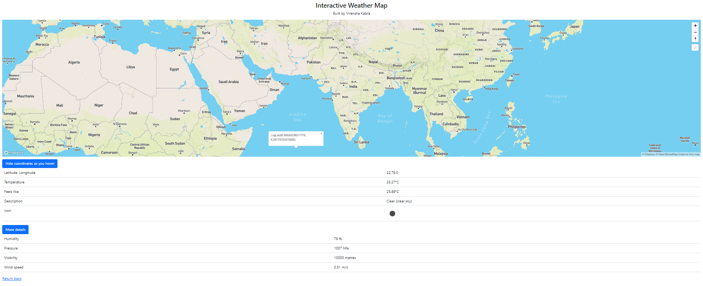

<h1>Interactive Weather Map</h1>

See Heroku deployment at https://weather-map-virendra.herokuapp.com/

<ul>
    <li>Clicking on the link given on the home-page opens up an interactive map</li>
    <li>You can show or hide geographical coordinates of the point the mouse is hovering over (toggle button)</li>
    <li>Clicking at any point in the map will update the weather information of that coordinate, that can be seen below the map</li>
    <li>Press the 'More Information' button for more weather data!</li>
</ul>

Mapbox and OpenWeatherMap's API have been used.

